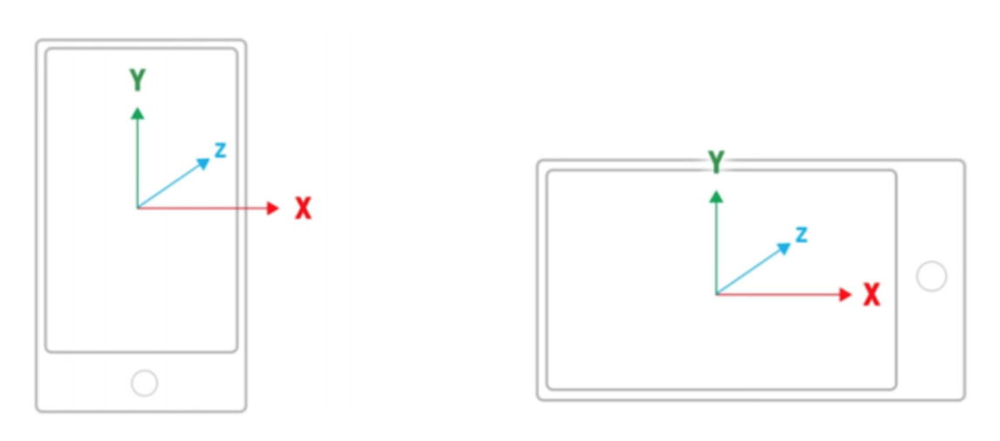

# Lecture 13 (04/09)

## Keyboard (QWERTY)
- standardised layout
- non-alphanumeric keys are placed differently
- accented symbols needed for different scripts
- minor differences between keyboards of different locations
- not optimal for typing; initially to prevent typewriters jamming
- alternative designs allow faster typing but large user base of QWERTY produces reluctance to change

## Eye-tracking
- control interface by eye gaze direction — look at a menu item to select it
- uses very low power laser beam reflected off of retina
- potential for hands-free control
- cheaper and lower accuracy devices available sit under the screen like a small webcam

## Touch
- speed: faster in many operations when compared to a traditional keyboard or a mouse
- ease of use: intuitive, requires less coordination
- accessibility: help users with physical limitations when they interact with devices
- device size: saves space, more area to interact with
- touch interfaces are increasingly becoming the primary method of interaction on mobile devices:
    - Microsoft requires that Windows Store apps are designed ’touch first’
    - meaning the interaction experience is optimized for touch (but also functions on other devices)
- specifically, Microsoft suggests that you:
    - design applications with touch interaction as the primary expected input method
    - provide different visual feedback for interactions of all types (touch, pen, stylus, mouse, etc.)
    - optimize targeting by adjusting touch target size, contact geometry, scrubbing and rocking
    - provide tooltips and handles to help improve touch accuracy for tightly packed UI items

### Touch input
- Unity features the Input.GetTouch() method, which allows touchscreen inputs to be processed
- this returns an array of Touch structs, each of which represents a single finger interacting with the screen
- each Touch instance contains a:
    - position: representing the location of the finger in screen
    coordinates
    - deltaPosition: representing the change in position since the
    previous frame
    - tapCount: to distinguish multi-tap gestures
    - phase: to determine whether a particular touch has begun/ended
    - fingerID: to relate Touches between frames

### Pinch & Zoom

## Other gestures
- many platforms implement their own Gesture Recognisers, designed to handle different situations
- Microsoft's Windows.UI.Input provides: Tap, DoubleTap, Hold, Drag, ManipulationTranslate, ManipulationRotate, ManipulationScale, and many others

## Sensors
- most mobile devices will include a number of sensors that can be used as game inputs, such as: ambient light sensor, accelerometer, gyroscope (for measuring angular velocity), GPS, proximity sensors, compass, others
- is important to check for the presence of sensors before attempting to use their input

### Accelerometer

- probably the most useful sensor for gameplay
- measures acceleration along the 3 principal axes
- Unity will handle changes in orientation, but other frameworks may not do so

### Gyroscope
