# Lecture 14 (05/09)

## Ambiguous vs logical
Ambiguous | Logical
--------- | -------
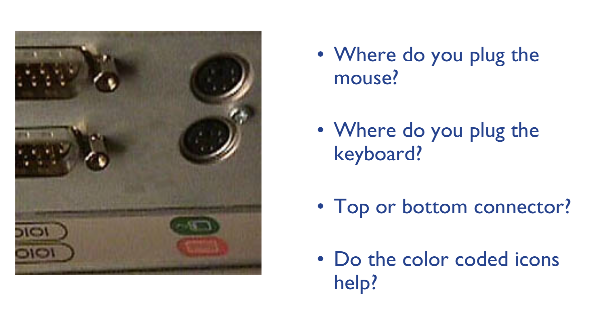 | 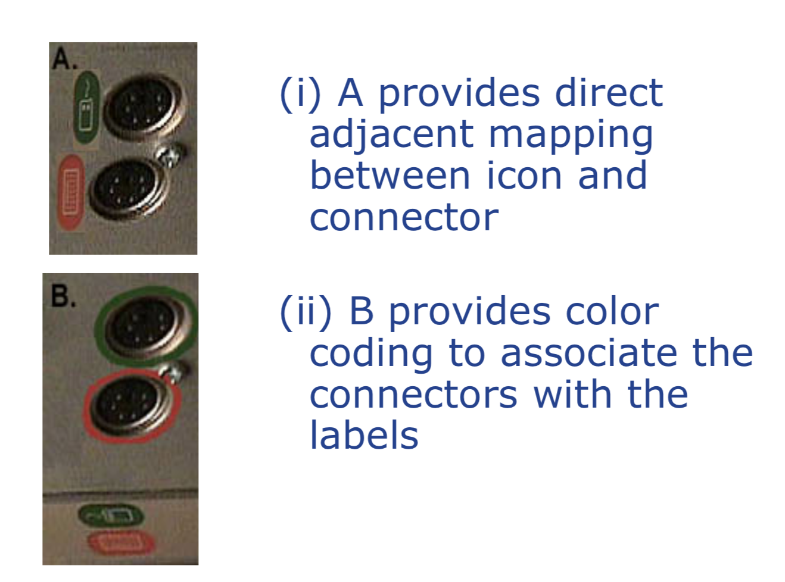
people make mistakes; design is important as to ensure no, or at least limit the scope/frequency at which, stupid mistakes are made

## Mapping
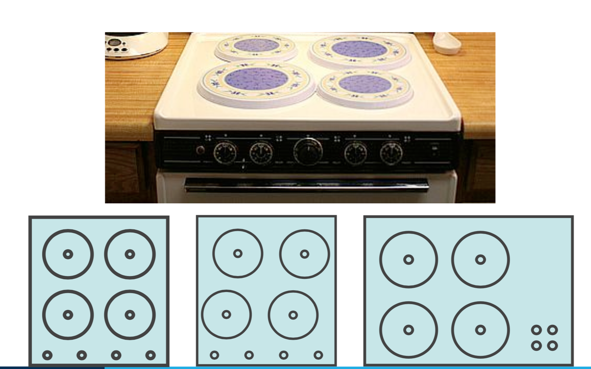
direct mapping of labels to items they represent is crucial

## Separation via logical function
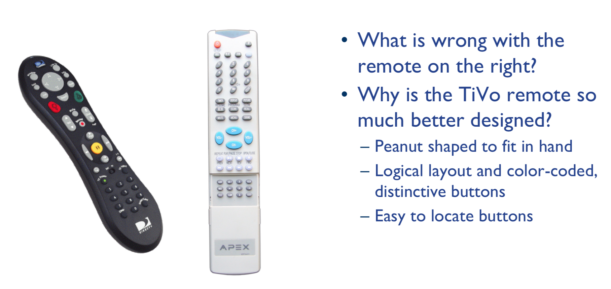

## Attention
- players' attention is grabbed and held at the right moments; players aren't distracted when paying attention to something important
- to grab the attention, an interface should exploit the use of effective principles of design, such as: colour, font, weight, sound

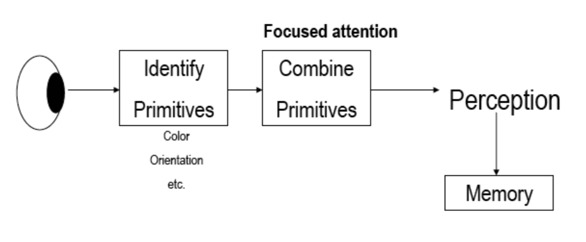

## Cues and highlighting
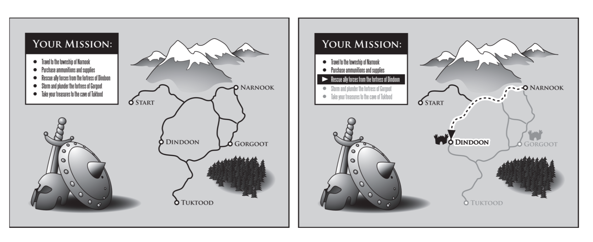

## Auditory prompts
auditory prompt whenever an event of significance has happened

## Progressive disclosure
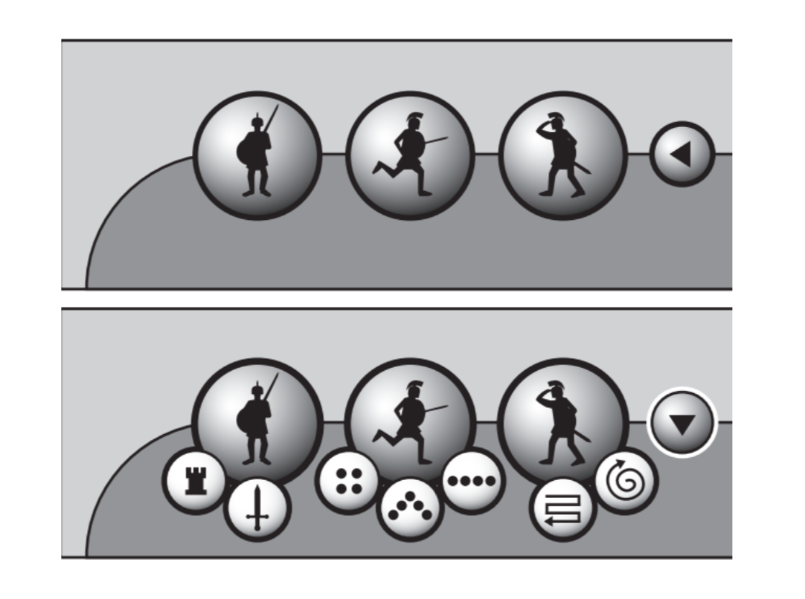
avoid overloading information to new players, while still maintaining flexibility as the players get more experienced

## Colour
general rules:
- avoid using too many colours simultaneously
- those that you choose, use them consistently throughout the interface
- avoid eye fatigue colours:
    - pairing blue and red, or blue and yellow
    - green text on red background or red text on green/blue background

Colour | Usage
------ | -----
blue | in large areas and not thin lines (blue has calming effect on the brain)
red & green | in the center of the field of view (edges of retina not sensitive to these colors)
black, white, yellow | in periphery

## Perception
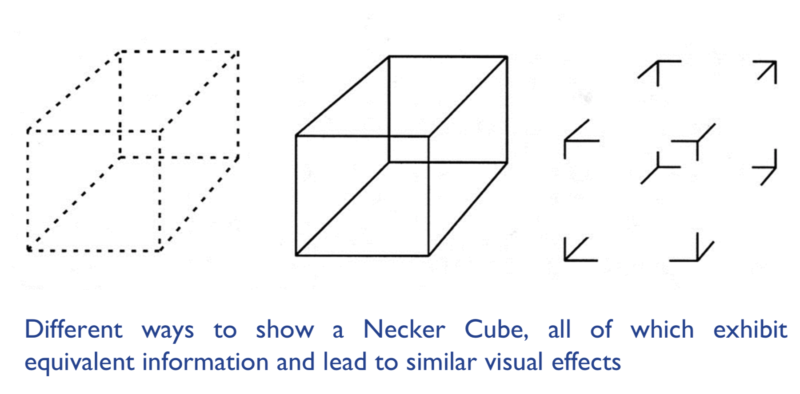
can use visual tricks to make game look a bit less cluttered or objects look like they are occupying less space

## Mental models
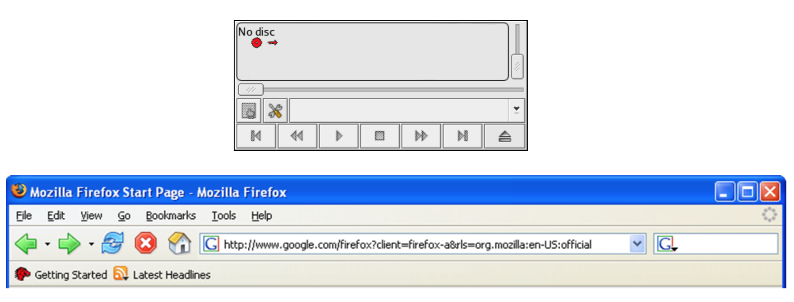
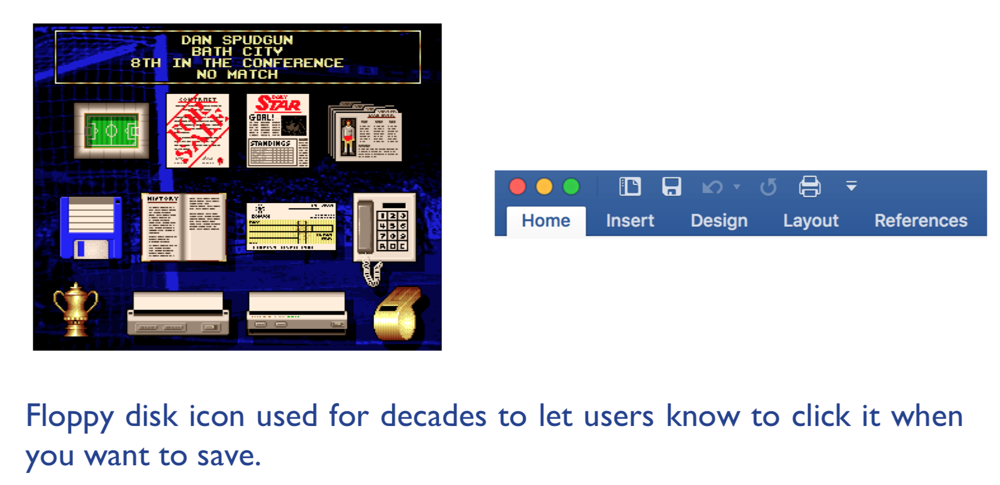
similar labels and icons may, over time and by convention, have different functions depending on context

## Memory
3 types of memory function:
- sensory memories (buffers for stimuli received through senses, continuously overwritten)
- short-term memory or working memory (rapid access ~70ms, rapid decay ~200ms, limited capacity - 7 ± 2 chunks)
- long-term memory (slow access ~1/10 second, slow decay, huge or unlimited capacity)

### Sensory memory
- lasts about 1-2 seconds and is the immediate perception of stimuli in the environment
- can either dismiss that perception, or transfer it to short-term memory (30 seconds) or long-term memory (forever)
- e.g. a specific smell, controller vibration

### Short-term memory
- reduce or eliminate the need to memorise and recall things
- should not expect novice players to memorise commands or concepts after showing them only once
- "knowledge in the world vs knowledge in the head" — everything the player needs to know is in the interface of the game itself

### Long-term memory
- design to transfer important and frequently-used commands and concepts to long-term memory
- if a certain command or concept has not appeared for a while it may be worth refreshing the player's memory by giving subtle cues or hints
- allow players to hide memory aids as they please

## Mnemonics
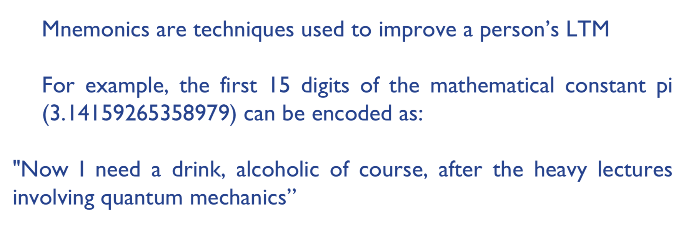

## Learning
- a good interface or a good game usually allows its users to learn by doing
- avoid overly complicated interfaces that will require an user to read a manual or FAQ
- people can become frustrated quickly and easily

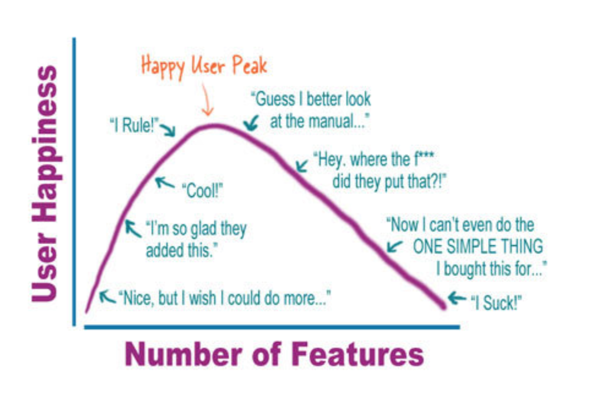