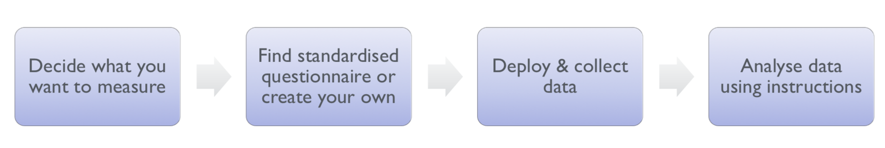
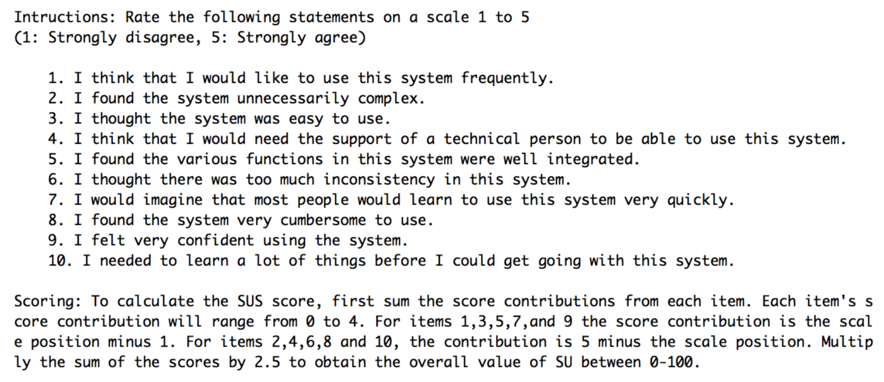

# Lecture 18 (19/09)

## Human involvement
- CG inherently human-centered
- presence of images, animations and interaction will influence users' behaviour
- computer applications are used by humans so it is important to evaluate them

## Evaluation
- tests usability (can the user quickly understand what's going on?) and functionality (can the user quickly get a hang of the features without reading a huge manual?) of system
- occurs in laboratory, field and/or in collaboration with users
- evaluates both design and implementation
- should be considered at all stages in the design life cycle

goals of evaluation:
- assess extent of system functionality (make sure all features are working)
- assess effect of different features on the user
- identify specific problems and attempt to solve them

### Lab studies
Advantages | Disadvantages
---------- | -------------
highly-controllable setting | lack of context of real-life use
specialist equipment available | difficult to observe several users collaborating
uninterrupted environment | -
appropriate if system location is dangerous or impractical for constrained single user systems to allow controlled manipulation of use | -

### Field studies
Advantages | Disadvantages
---------- | -------------
natural environment | distractions
context retained (though observation may alter it) | noise
longitudinal studies possible | -
appropriate where context is crucial for longitudinal studies | -

## Evaluating designs
### Cognitive walkthrough
- evaluates design on how well it supports user in learning task (which part of the interface is not intuitive enough for the user?)
- usually performed by expert in cognitive psychology
- expert "walks through" design to identify potential problems using psychological principles
- forms used to guide analysis
- for each task walkthrough consider:
    - what impact will interaction have on user?
    - what cognitive processes are required?
    - what learning problems may occur?
- analysis focuses on goals and knowledge: does the design lead the user to generate the correct goals?
- usually for more complex systems; not generally suitable for games where the user is generally expected to explore on his/her own

### Heuristic evaluation
- previously-specified usability criteria (heuristics) are identified
- design examined by experts to see if these are violated
- example heuristics:
    - system behaviour is predictable
    - system behaviour is consistent
    - feedback is provided
- heuristic evaluation "debugs" design

### Review-based evaluation
- results from the literature used to support or refute parts of design (review a similar system that's already been released for its design strengths and weaknesses)
- care needed to ensure results are transferrable to new design (where applicable, try to cover the weaknesses)
- model-based evaluation
- cognitive models used to filter design options

## Observational methods
### Think aloud
- user observed performing task
- user asked to describe what he is doing and why, what he thinks is happening, etc.

Advantages | Disadvantages
---------- | -------------
simple — requires little expertise | subjective
can provide useful insight from user perspective | selective
can show how system is actually used | act of describing may alter task performance

### Cooperative evaluation
- variation on think aloud
- user collaborates in evaluation
- both user and evaluator can ask each other questions throughout
- additional advantages:
    - less constrained and more feedback is expected
    - user is encouraged to criticise system
    - clarification possible

### Post-task walkthroughs
- user reacts on specific actions after the whole task
- used to "fill in" intention
- transcript played back to participant
    - seek comments
    - immediately &rarr; fresh in mind
    - delayed &rarr; evaluator has time to identify questions
- useful to identify reasons for actions and alternatives considered
- necessary in cases where think aloud is not possible

Advantages | Disadvantage
---------- | ------------
analyst has time to focus on relevant incidents | lack of freshness
avoid excessive interruption of task | may be post-hoc interpretation of events

### Recording data
- paper and pencil (cheap, but limited to writing speed)
- audio (good for thinking aloud, but difficult to match with other protocols)
- video (accurate and realistic, but needs special equipment + obtrusive)
- computer logging (automatic and unobtrusive, but difficult to analyse large amounts of data)
- user notebooks (coarse and subjective, useful insights, good for longitudinal studies)
- mixed use in practice
    - audio/video transcription difficult and requires skill
    - some automatic support tools available

## Physiological methods
### Eye tracking
- head or desk mounted equipment
- tracks the position of the eye by capturing eye movements
- reflects the amount of cognitive processing an interface requires
- measurements include
    - fixations: eye maintains stable position; number and duration indicate level of difficulty with interface
    - saccades: rapid eye movement from one point of interest to another
    - scan paths: moving straight to a target with a short fixation at the target is optimal

### Physiological measurement
- emotional response linked to physical changes
- may help determine a user’s reaction to an interface on an emotional level
- measurements include:
    - heart activity, including blood pressure, volume and pulse
    - activity of sweat glands: Galvanic Skin Response (GSR)
    - electrical activity in muscle: electromyogram (EMG)
    - electrical activity in brain: electroencephalogram (EEG)
- some difficulty in interpreting these physiological responses (more research-oriented)

## Query techniques
### Interviews
- analyst questions user on one-to-one basis usually based on prepared questions
- informal, subjective and relatively cheap
- 2 types of interview questions:
    - "closed questions":
        - have a predetermined answer format, e.g. "yes" or "no"
        - are easier to analyse, but can lack detail
    - "open questions" do not have a predetermined format
- avoid:
    - long questions
    - compound sentences — split them into 2
    - jargon and language that the interviewee may not understand
    - leading questions that make assumptions (why do you like ...?)
    - unconscious biases, e.g. gender stereotypes

Advantages | Disadvantages
---------- | -------------
can be varied to suit context | very subjective
issues can be explored more fully (allow for follow-up) | time-consuming
can elicit user views and identify unanticipated problems | -

### Questionnaires
- set of fixed questions given to users
- need careful design:
    - what information is required?
    - how are answers to be analysed?
- styles of question: general, open-ended, scalar, multi-choice, ranked
- what to measure: usability, mental effort required, user experience, etc.
- some available questionnaires:
    - post-study questionnaires: QUIS (Questionnaire for User Interaction Satisfaction), SUS (System Usability Scale)
    - experimental comparisons of post-study questionnaires: ASQ (After-Scenario Questionnaire), ER (Expectation Ratings)
    - questionnaires for assessing the perceived usability of websites: WAMMI (Website Analysis and Measurement Inventory), SUPR-Q (Standardized Universal Percentile Rank Questionnaire)
    - other questionnaires of interest:, CSUQ (Computer System Usability Questionnaire), USE (Usefulness, Satisfaction, and Ease of Use), http://www.allaboutux.org/

Advantages | Disadvantages
---------- | -------------
quick and reaches large user group | less flexible
can be analysed more rigorously | less probing

#### Questionnaires are instruments
Advantages | Disadvantages
---------- | -------------
measure something specific | more difficult to elicit user views and identify unanticipated problems
reliable | -
measurements can be compared | -

#### SUS (System Usability Scale)

## Choosing an evaluation method
Consideration | Options
------------- | -------
what to evaluate | design vs. implementation
style of evaluation | laboratory vs. field
how objective | subjective vs. objective
type of measures | qualitative vs. quantitative
level of information | high level vs. low level
level of interference | obtrusive vs. unobtrusive
resources available | time, subjects, equipment, expertise