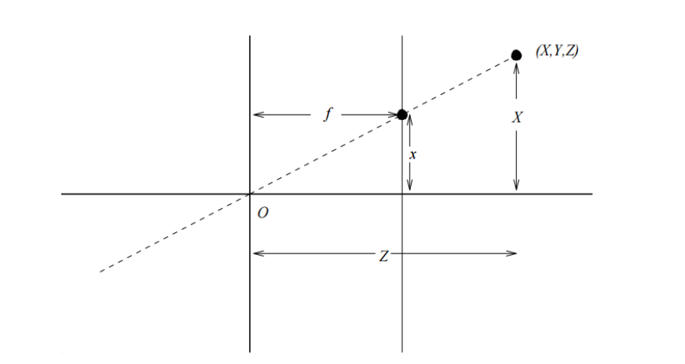

# Lecture 2 (25/07)

## Geometry of Image Formation
Main problem: how are 3D objects projected onto 2D images?
- mapping from 3D space to 2D image surface, moving from a higher dimensional image to a lower dimensional image
- x, y, z-points in the 3D world, called voxels, are transformed into x, y pixels in a 2D image
- mapping from 3D to 2D directions; rays of light to/from the observer will change as well

## Pinhole Camera

where pinhole does not allow any other light to enter aside from that of the candle (virtual camera in Unity works similarly)

Larger focal distance = larger/taller projected image

### Pinhole camera vs Human eye
- pinhole camera and human eye work very similarly, but the brain flips the images we see
- eyes have lenses
- eyes can focus on particular objects
- eyes have pupils that dilate changing the amount of light that comes in
- a pair of eyes (as opposed to a single hole) allows for better perspective

### Virtual Camera

- image projection surface imagined to be in front of projection scene/centre (instead of projecting the image behind the pinhole, it's projected in front of the scene)
- geometrically equivalent
- often more convenient to think about projection (because the image is in the right orientation)

## Perspective
### Formulas
Point p = (x, y, z) in 3D space has projection (x, y) in the image where:

where f is the "focal distance" (sometimes also called d)

- triangles xOf and XOZ have the same proportions
- when modelling, important to maintain the correct proportion 
- these formulas apply only for camera-centred coordinates, for which perspective projection has a particularly simple form. For arbitrarily-centred coordinate systems, 3D transformations are necessary

Need to be able to project image virtually without losing/changing:
- scale/size
- orientation

### Projection
need to convey depth in 1 (1-point perspective), 2 (2-point perspective), or 3 (3-point perspective) of the 3 dimensions (length, width, height)

3 key components when perspective drawing or modelling:
- horizon line (eye level) — where eye meets the image on the screen
- vanishing points — point in linear perspective where all vanishing lines converge
- vanishing lines — orthogonal lines that meet at the vanishing point on the horizon line

(no axis is parallel because 3 vanishing points are used on all of the dimensions of the 3D shape)

Differences between n-point perspective (n = 1, 2, 3):
- number of vanishing points
- number of parallel axes

## Polygonal Geometry
Polygon — any plane figure bounded by straight line segments but can comprise these forms:
- polygonal arcs (polylines)	
- polygonal boundaries (closed polylines)	
- filled polygons	

polygons are very useful, both in themselves and as building blocks for approximating arbitrary curved arcs and regions.

Representation:
- set of line segments	
- ordered sequence of vertices using absolute or relative coordinates	
- walking order convention applies — the order, clockwise or counter-clockwise, in which a polygon is constructed matters (to be rendered or not))	

### Polygons
Types:

Properties:
- in a convex polygon, no internal angle is greater than 180 deg
- in a concave polygon, there are internal angles that can be greater than 180 deg (convex polygon is a certain type of concave polygon)
- concave polygons can be represented as a conjunction of convex polygons (convex polygons have certain properties that simplify geometric operations and tesselations)

Important in showing detail:
- number of polygons (triangles)
- distance of object will have a big influence on how detailed the object should be

## Extra notes
polygons are one of the most widely used models in computer graphics and are useful for representing both 2D shapes and 3D objects.

the level of detail affects the capability to achieve higher performance, by adapting the number of polygons used

### Tutorials
https://unity3d.com/learn/tutorials
https://unity3d.com/learn/tutorials/projects/roll-ball-tutorial
https://github.com/nicksuch/Roll-a-ball
https://docs.unity3d.com/Manual/