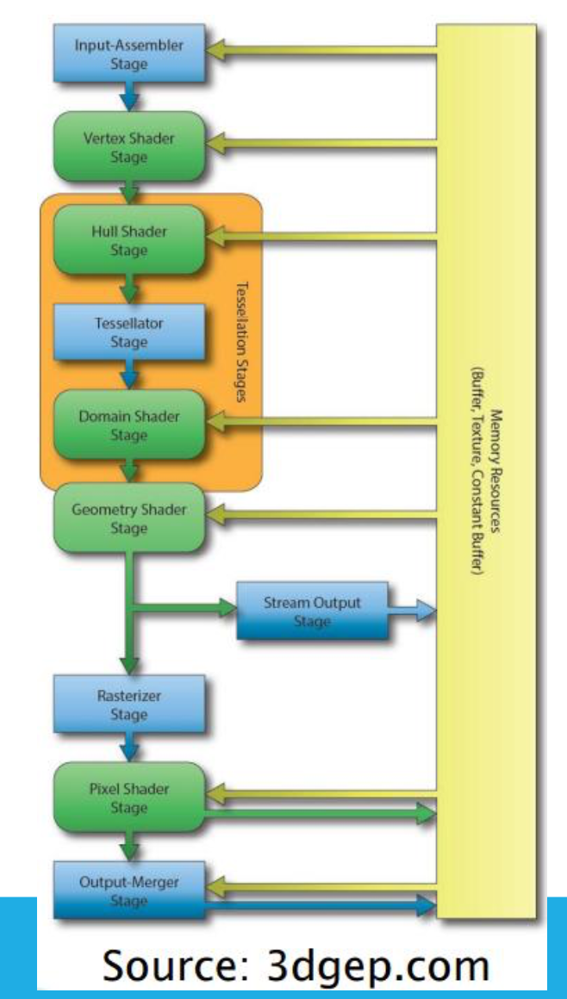
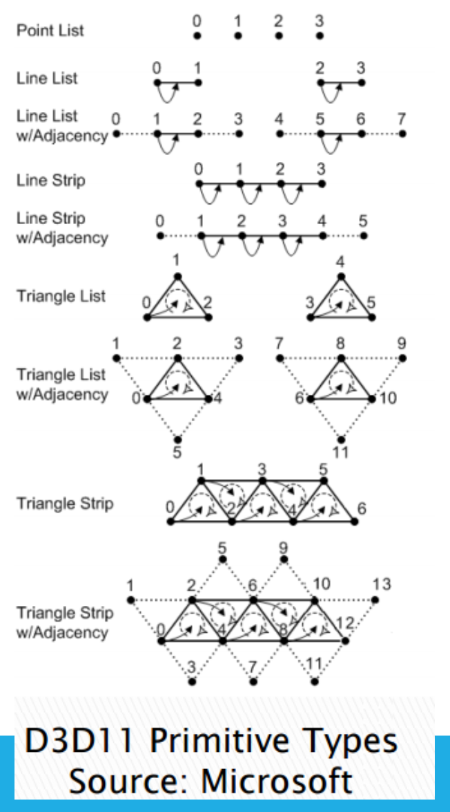
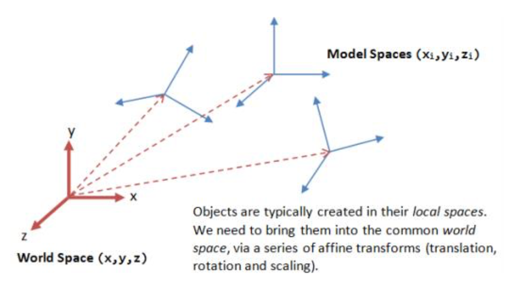
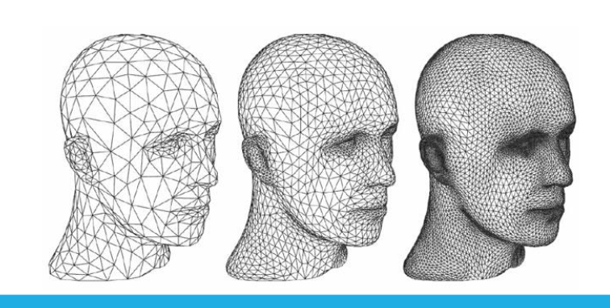
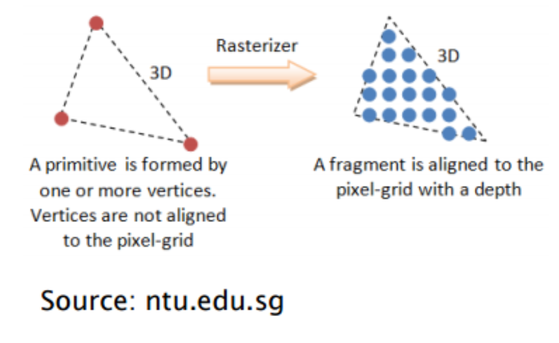
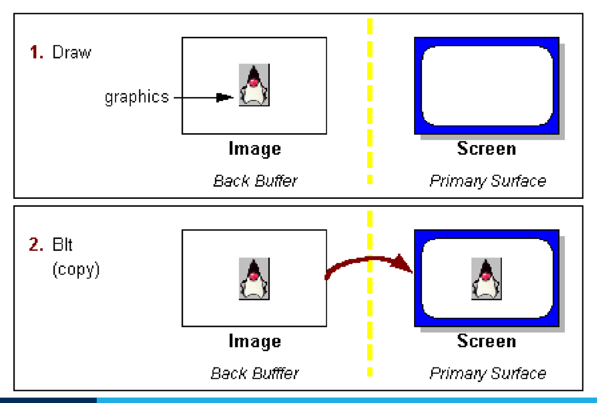
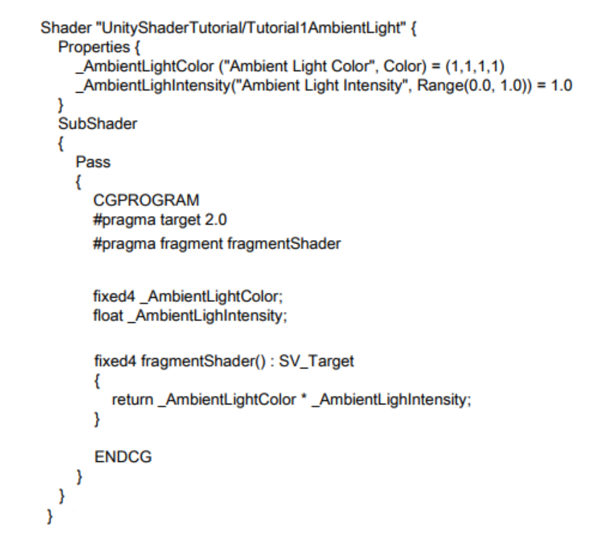
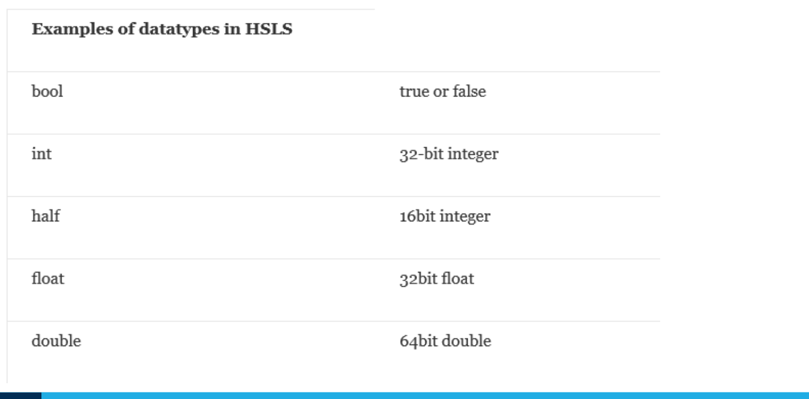
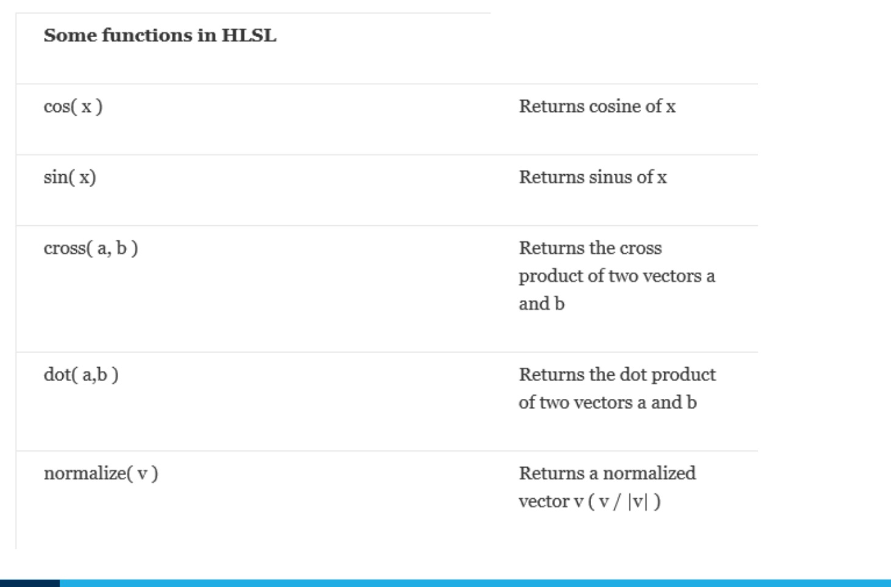

# Lecture 3 (31/07)

## Graphics programming
- game engines and other graphics programs, generally use either Direct3D (Windows) or OpenGL (most other platforms)
- modern graphic cards (GPUs) will support some version of both APIs
- game engines build upon these APIs to make development easier

## Representing objects
- graphic cards render objects as triangles for efficiency (triangle is the simplest polygon)
- any polyhedron can be represented by triangles
- other 3D shapes can be approximated by triangles

## Rendering pipeline
Rendering pipeline — all the stages that the CG/3D apps will go through before getting the end product/image

- both OpenGL and Direct3D operate a pipeline, sharing certain stages but also having certain differences that are exclusive to each other
- this allows the programmer to perform a number of different operations on the input data, providing greater efficiency

### Input assembler
- building block stage (where everything gets prepared for the subsequent stages)
- reads data from buffers into a primitive format that can be used by the other stages of the pipeline
- we mainly use Triangle Lists, although it can receive other types as well

### Vertex shader
- performs operations on individual vertices received from the Input Assembler stage
- typically includes some transformation on the primitives
- may also include per-vertex lighting

one of the things that the vertex shader can do is take the red coordinates and carry out some transformation on them (translation, rotation, scaling)

### Tesselation
- optional stages, pretty recent; only added with Direct3D 11
- allow us to generate/add additional vertices within the GPU
- can take a lower detail model and render in high detail
- can perform level of detail scaling

### Geometry shader
- while vertex shader operates on individual vertices, geometry shader does so on an entire primitive/geometry
- optional stage, only added with Direct3D 10
- can perform a number of algorithms, e.g. particle systems, shadow volume generation

### Stream output
- allows us to receive data (vertices or primitives) from the geometry shader and feed it back into the pipeline for processing by another set of shaders
- this can be used to have the GPU do the processing that would otherwise have been done on the CPU
- useful for particle systems' updating, e.g. waves, ripples
- can repeat the whole cycle of passing it back into the pipeline if need to model something complex, e.g. particle system

### Rasterizer
- converts vector information (composed of shapes, primitives) into a raster image (composed of pixels) for the purpose of displaying real-time 3D graphics
- performs culling

the primitive and vertices pass by the rasterizer and the pixels get filled in (so that final product is an image instead of just points in the model)

#### Culling
- culling: instructing the pipeline that certain aspects of the model should not be rendered
- no point in rendering triangles facing away (hidden) from the camera, and so they are culled
- DirectX performs 'counter-clockwise culling'
- triangles with vertices in a counter-clockwise order are culled

### Pixel (fragment) shader
- produces colour values for each interpolated pixel fragment (colour the image)
- per-pixel lighting can be performed
- can also produce depth values for depth-buffering

### Output merger
- combines pixel shader output values to produce final image
- may also perform depth buffering

## Double buffering
- as new images are drawn, don't want them to go immediately to the screen
- to prevent the screen from updating before a new frame has been completely drawn (tearing)
- instead, draw next frame to a buffer and swap buffers (update screen) only when complete

## Frame rate
- frame rate (X fps): data sent through the entire pipeline X amount of times per second
- if frame rate is unstable, may notice tearing

## Sample Unity shader

- `Shader "UnityShaderTutorial/TutorialAmbientLight"` — the name used to identify it
- `Properties {_AmbientLightColor ("Ambient Light Color", Color) = (1,1,1,1) (RGBA - Black) _AmbientLightIntensity("Ambient Light Intensity", Range(0.0, 1.0)) = 1.0}` — specifying the colour and brightness of the object (these can also be set in the GUI and accessed in the shader)
- `SubShader` — different SubShaders to operate on different hardware; writing a particular SubShader for more powerful machines and another separate one for less powerful ones
- `Pass` — a subshader can be split into multiple passes to render the geometry more than once
- `CGPROGRAM` — the ‘meat’ of the shader, where we specify code to act at different levels of the pipeline
- `#pragma target 2.0` — specifies the hardware required for the shader to run. 2.0 is the minimal setting, correspond to Shader Model 2.0 (DX9)
- `#pragma fragment fragmentShader` — specifies which stage of the pipeline the code is for (in this case the pixel/fragment shader) and the name of the function that will be used as the fragment shader
- `fixed4 fragmentShader(): SV_Target {return _AmbientLightColor * _AmbientLightIntensity;}` — takes the properties defined earlier (colour and brightness) and applies them to the target object (sets the colour of a particular pixel to a specific value). The SV_Target semantic instructs the Output Merger stage interpret this as a color value

## CG/HLSL
- "C for Graphics/High-Level Shader Language"
- syntax quite similar to C, although more restricted

