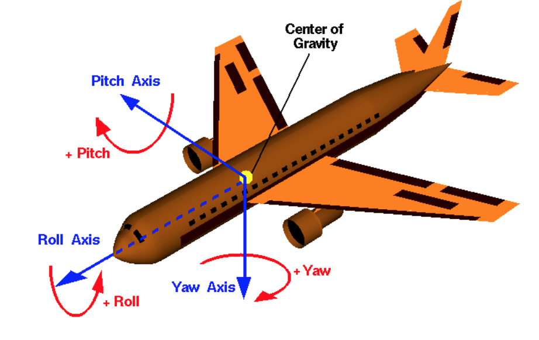
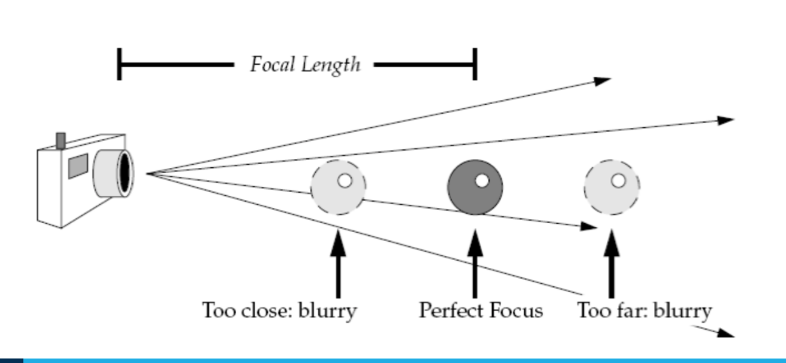
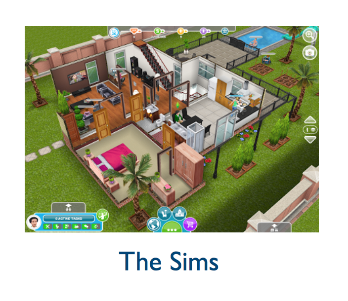
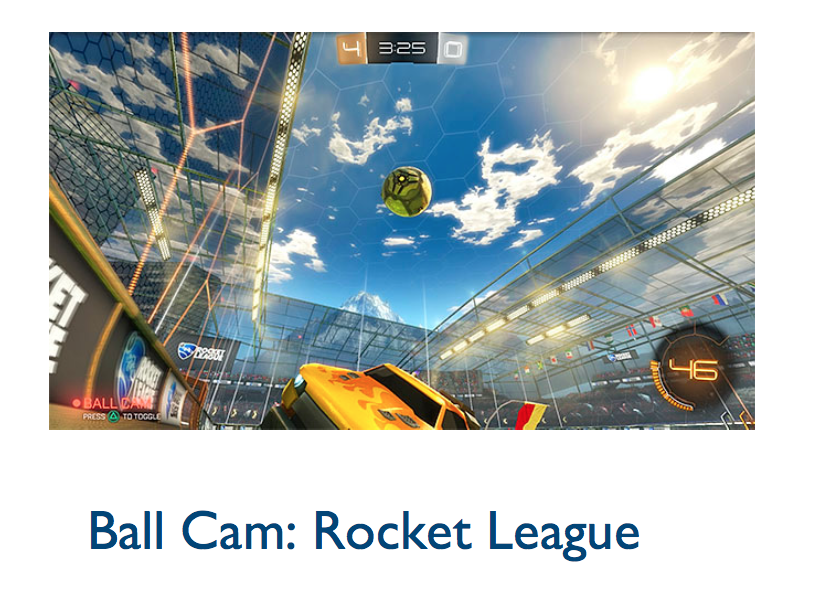
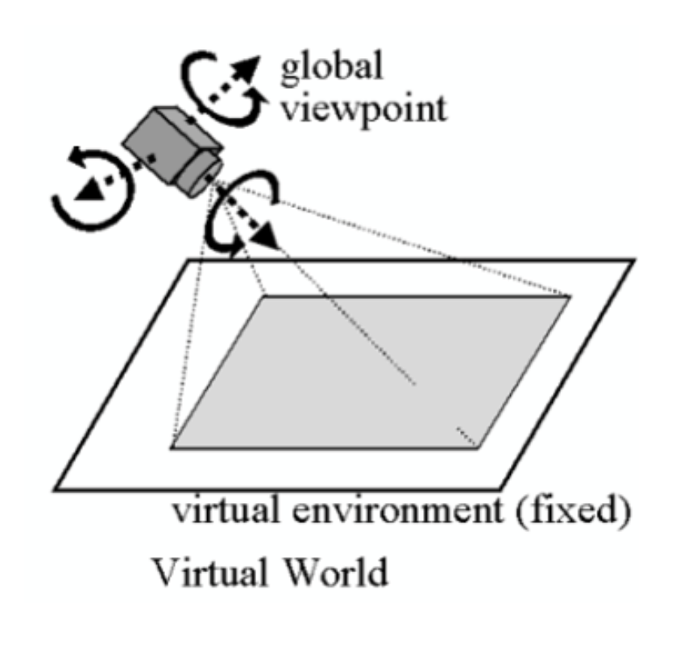
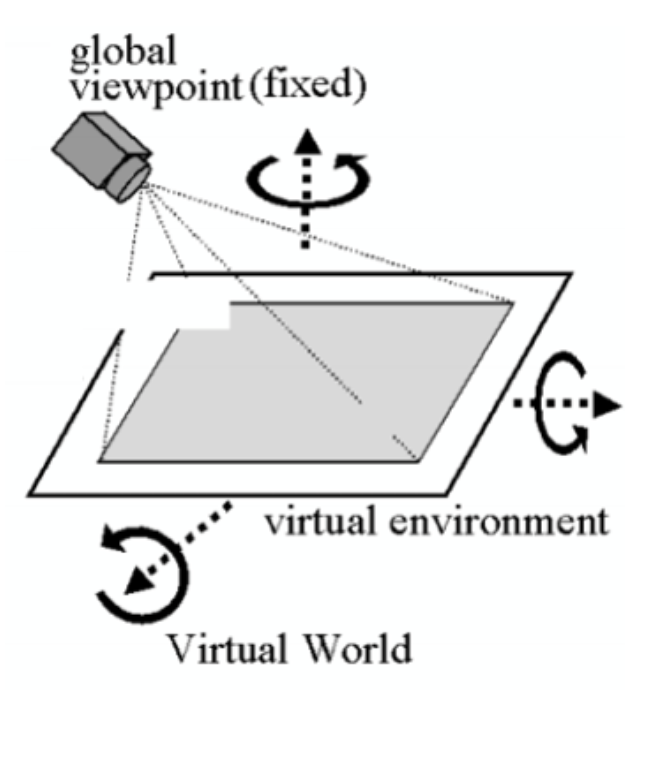

# Lecture 4 (01/08)

## Introduction
- camera control a requirement in nearly all interactive 3D apps
- including but not limited to: visualisations, games, cinematography, etc.
- crucial to have effective camera control via positioning and movement; also, user vs app controlling the camera?

## Camera parameters
### Principal axes
Paratemers | Definition
---------- | ----------
roll | rotation around the front-to-back axis
pitch | rotation around the side-to-side axis
yaw | rotation around the vertical axis

### Focal length
- approximates behaviour of real camera lens
- defines where the focus of the scene is — objects at distance of focal length are in focus; other objects get blurred
- also affects field of view

### Zoom
- function of focusing on a section of an image and increasing its overall size to manipulate or view in greater detail
- when zooming, each of the pixels that make up the image grow and make the image appear pixelated or jaggy

## Camera control
camera control dependent on:
- balance of camera control approaches
- application domain
- nature of user (goals, expertise, etc.)

### Camera control approaches
- user exercises full interactive control (app never controls the camera)
- user exercises some degree of interactive control (user can move camera around, but the app automatically presets the camera at certain times)
- app assumes full control of camera

#### User camera control
interactive approaches propose a set of mappings between the dimensions of the user input device (e.g. mouse, keyboard) and the camera parameters

#### Automatic camera control
app itself takes care of camera control, either based on user preferences (some degree of control) or predefined heuristics set during implementation

### Application domain
camera control depends on the application domain, such as: 3D modelling, visualisation, games, etc.

#### Visualisation
- interactive camera control needs to allow user to go through the dataset at their own pace and be able to explore specific points of the dataset
- restricted to a small number of navigational idioms, for example, the identification of a number of interesting points or regions in the data, and the exploration of the remaining data in relation to these
- challenging to decide how much detail the user could have and how deep into the data the user could go
- automatic camera control and assisted direct camera control has the potential to greatly enhance interaction with large data sets, benefitting the user

#### Games
- interactive computer games impose the necessity for real-time camera control
- enforcement of frame coherency (smooth changes in camera location and orientation) is necessary to avoid disorienting players
- games are inherently different from film in that the camera is usually either directly or indirectly controlled by players (typically through their control of characters to which a camera is associated)
- narrative aspects of real-time games can be supported by the appropriate choice of shot edits both during and between periods of actual gameplay
- a potential camera control problem involves following one or more characters whilst simultaneously avoiding occlusions in a highly cluttered environment

##### Types of viewpoints
Type | Characteristics
---- | ---------------
first-person | <ul><li>intent is to give the user a sense of being the character in the virtual environment</li><li>most common genre is first-person shooter (FPS)</li><li>camera control is unproblematic, since is directly mapped to the location and orientation of the character</li></ul>
third-person | <ul><li>camera system tracks characters from a distance, generally slightly above and behind the main character</li><li>responds to both local elements of the environment (to avoid occlusion) and the character's interactions (maintaining points of interest in shot)</li><li>problems arise when players gain an unfair advantage, or when there is unwanted occlusion by objects in the environment</li></ul>
action replay | <ul><li>widely used in modern racing or multi-character games where there are significant events that a player might like to review</li><li>can also be important for narrative reasons</li><li>replays have to be meaningful to the player, such that the elements of the scene and their spatial configuration are readily identifiable</li><li>interactive storytelling presents a number of interesting opportunities for camera control</li></ul>

## Navigation metaphors
### Eyeball in hand
- user can manipulate the viewpoint as if it was held in their hand, as the mouse is moved
- user imagines moving themself around the object
- certain views from far above or below cannot be achieved or are blocked by other objects

### World in hand
- connects user's navigation directly to the object or environment to be moved
- user can imagine that the object is in their hand as the mouse is moved
- useful for a single object case (e.g. cube), but not very good in navigating a virtual environment

### Flying vehicle
- camera is treated as a control stick for an airplane
- easy for a user to get around in 3D space in a relatively unconstrained way

### Walking
- allows inhabitants of a virtual environment to navigate by simply allowing them to walk
- camera moves in the environment while maintaining a constant distance (height) from a ground plane

### Combining navigation metaphors
- optimal navigation method will depend on the exact nature of the task
- apps tend to use multiple metaphors in sequence:
	- flying vechile for navigation of a large landscape
	- world in hand for proximal inspection
	- walking to give the sense of presence in an architectural space
- there needs to be smooth and seamless transitions between them