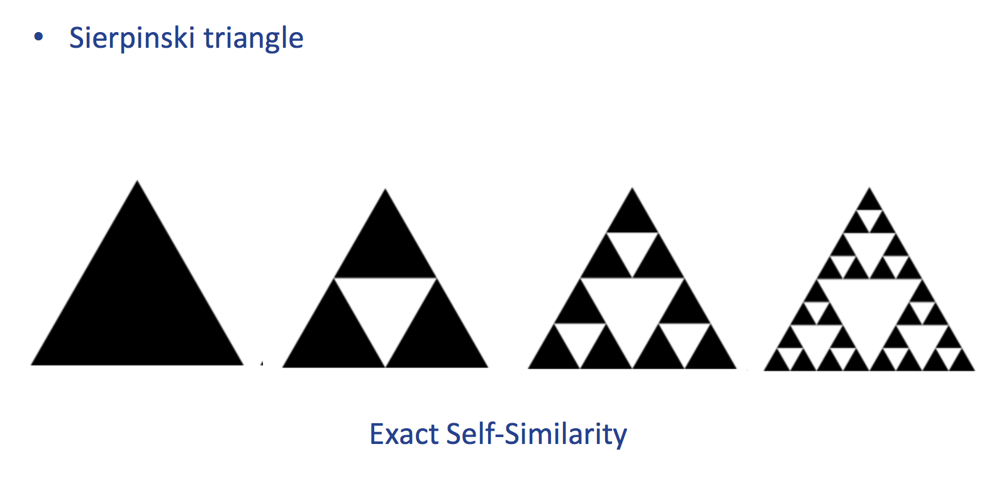
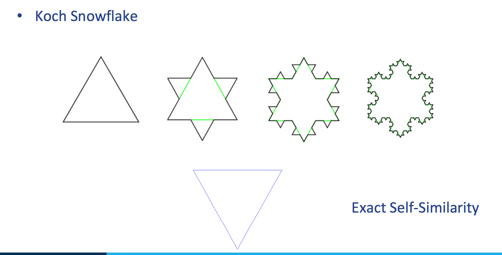
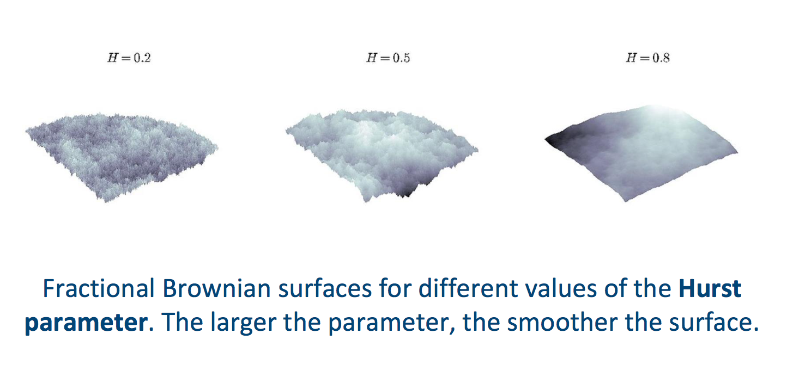
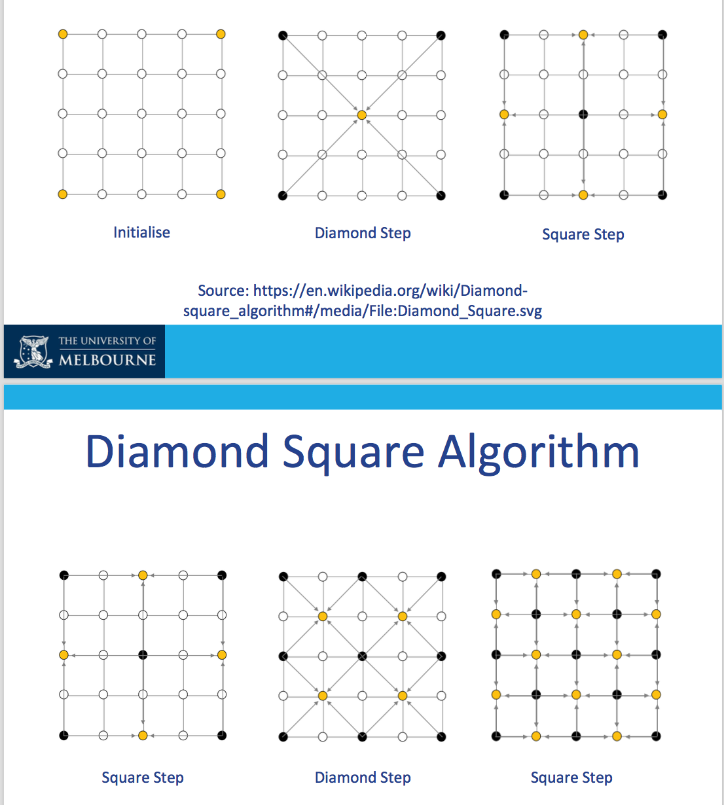

# Lecture 5 (07/08)

## Fractal
- coined by mathematician Benoit Mandelbrot, deriving from Latin word _fractus_ (broken)
- geometric shape generated using a series of recursive rules
- they have a pattern that repeats itself at different scales, property known as self-similarity

### Self-similarity
3 types of self-similarities found in fractals:
- exact self-similarity (strongest):
    - fractal appears exactly identical at different scales
    - very rare in nature (things tend to be more random)
    - fractals defined by iterated function systems (geometric shapes) often display exact self-similarity
- quasi-self-similarity:
    - fractal appears approximately (but not exactly) identical at different scales
    - contain small copies of the entire fractal in distorted and degenerate forms
- statistical self-similarity (weakest):
    - fractal has numerical or statistical measures which are preserved across scales
    - random fractals (e.g. fractal landscapes) are examples of fractals that are statistically self-similar, but neither exactly nor quasi-self-similar

## In geometry

## In CG
- complex pictures generated by formula and using several iterations
- this means one formula is repeated with slightly different values over and over again, taking into account the results from the previous iteration
- possible to create realistic textured landscapes, such as mountain ranges, coastlines or even destruction patterns
- typical basic primitives of CG (lines, circles, polygons) are not suitable for fractals, because it would need millions of these for an acceptable resolution
- special tailoring of algorithms for rendering fractals is required

## Brownian motion
- Robert Brown (1827) while observing pollen move in water: matter consists of tiny particles in motion
- describes the stochastic (random) movement of small particles of matter in a fluid (liquid or gas)
- used by Benoit Mandelbrot for the modelling of natural phenomena

fractional Brownian surfaces for different values of the Hurst parameter — the larger the parameter, the smoother the surface

## Diamond square algorithm
- generate heightmaps from a 2D grid
- start by setting the initial height values for the corner points of the grid
- perform a diamond step and a square step alternately until completion:
    - diamond step: for each square in the array, set the midpoint of that square to be the average of the intersecting points plus a random value
    - square step: for each diamond in the array, set the midpoint of that diamond to be the average of the intersecting points plus a random value
