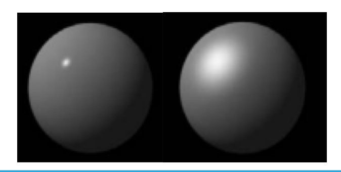
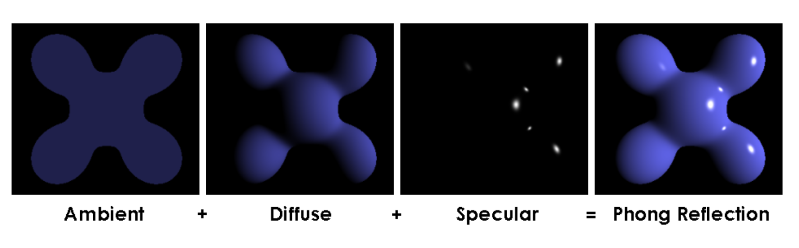

# Lecture 6 (08/08)

## Intro to illumination
- how light interacts with object surfaces
- useful to understand illumination models and surface properties for realistic shading
- in real scenes, there is a variation of shading over object surfaces caused by:
    - surface material properties
    - orientation of surfaces
    - nature and direction of light sources
    - view direction
    - shadows

## Surface types
in order to create realistic renderings by CG, need to attempt to simulate shading for different kinds of surfaces:
- self-luminous
- refractive
- translucent
- reflective — diffuse vs specular

Surface type | Definition | Example
------------ | ---------- | -------
self-luminous | object that has in itself the property of emitting light | glow-in-the-dark jellyfish
refractive | change in the direction of light caused by a change in transmission medium | light rays through water/glass
translucent | light interacts in more complex ways, e.g. scatters | certain minerals
reflective (diffuse) | light is reflected from a surface in many different angles | rugged surfaces, e.g. carpet
reflective (specular) | light is reflected from a surface in the same angle as the incident ray | glossy surfaces, e.g. polished steel

in CG, these patterns can provide useful perceptual clues about the 3D structure of the scene.

### Isotropic surfaces
in isotropic surfaces the relationship between the incoming (incident) and outgoing (reflected) direction of light is the same over the whole surface (otherwise anisotropic)

illumination models generally most often consider isotropic surfaces only, however:
- certain kinds of material (e.g. velour) and certain rock or stone faces (look different depending on angle of view)
- this is a result of their asymmetric texture

## Illumination model
choice of illumination model is a compromise between modelling the physics fully, and the computational cost:
- simple illumination models do not consider shadows, reflections or photon-based effects (e.g. radiosity)
- in full ray tracing, one considers all rays of light and their recursive interaction between each object — very computationally complex
- decide model limitations, e.g. how many times we will recurse (how many times we will allow for re-reflection)

## Components of light
there are 3 components of light:
- ambient component
- Lambertian (diffuse) component
- specular component

### Ambient component
the simplest kind of shading is that from ambient illumination — light that comes uniformly from all directions

### Lambertian (diffuse) component
- brightness depends only on the angle θ between the direction (L) to the light source and the surface normal (N)
- this is the so-called Lambertian reflection (also matte/diffuse/body reflection)
- in Lambertian reflection light is re-radiated uniformly in all directions

#### Surface orientation
- for a given small surface patch, the amount of light radiated towards the viewer is greatest when the surface normal is pointing straight at the viewer, and falls off according to a cosine law as the surface slants away from the viewer
- however, at the same time, for a given visual angle subtended at the viewer, more of the surface is seen within that angle as the surface slants away from the viewer, again according to a cosine law
- these 2 effects exactly compensate, so overall, the intensity of Lambertian reflection is independent of surface orientation with respect to the viewer

#### Distance of viewer from surface
- as the surface moves further away from the viewer, the received light intensity falls off as an inverse-square law in distance
- however, for a given angle subtended at the viewer, the amount of surface included grows in proportion to the square of the distance
- these 2 effects also compensate, so the intensity of Lambertian reflection is independent of the distance of the surface from the viewer

> Is there a difference in the intensity of Lambertian reflection of the projector hitting the wall for those sitting on the front row and for those sitting on the last row?
> it is the same

#### Distance of light source from surface
- intensity of the incoming light, and therefore of the reflected light, depends on the distance of the surface from the light source
- physically, for a point light source, this dies off in inverse proportion to the square of the distance
- however, if this physical law is followed in rendering, the intensity seems to go down unrealistically fast (this is because most real lighting is not from a single, ideal point source)

> If we moved the projector forward would it have any effect on the intensity of Lambertian reflection?
> increased intensity

> What if we moved the projector backwards?
> decreased intensity

### Specular component
- when a ray of light hits a surface, some fraction of it is also reflected immediately at the outer boundary of the surface
- this is the specular reflection and leads to highlights and glossiness
- it is influenced by orientation and distance of both viewer and light source
- if the surface were a perfect mirror, then the reflection would follow the law of perfect reflection
- for most glossy surfaces, however, the reflected light is spread out, to a greater or lesser degree, from the direction of perfect reflection, caused by microscopic unevenness of the surface (e.g. scratches in steel or texture in plastic)

this spread of reflection is modelled by looking at the angle α between the direction of perfect reflection and the viewer direction, and modify the reflected intensity by the factor (cos α)^n

(cos α)^n is at its max when the viewer direction coincides with the direction of perfect reflection, and becomes less for directions away from this

#### Specular reflection exponent
the exponent n is the specular reflection exponent and controls the degree of spread:
- high values of n (e.g. 100, 200) lead to a rapid fall-off and sharp highlights, corresponding to a very glossy surface, almost like a mirror
- low values of n  (e.g. 1, 2) lead to a slow fall-off and spread-out, more diffuse highlights, and a more matte surface appearance

## Combined lighting models
- the combination of the 3 components is adequate to give reasonably realistic renderings
- there are also effects of incident or reflected light being blocked by small-scale surface roughness
- however, these effects can usually be ignored (assume isotropic surfaces)

## Phong reflection model
- developed in 1975
- frequently used shading method for many rendering applications
- popular due to efficient use of computation time per rendered pixel

spheres shaded using Phong's reflection model for increasing values of n (higher specular reflection exponent from left to right) and k (higher specular reflectivity coefficient, albedo, from top to bottom)

## Summary
- Lambertian surfaces exhibit body reflection (or re-radiation), independent of orientation and distance from viewer (but not light source), leading to a matte appearance
- specular surfaces exhibit surface reflection, dependent on orientation and distance of both viewer and light source, leading to glossy appearance with highlights
- Phong illumination model captures a combination surface properties including ambient, Lambertian and specular