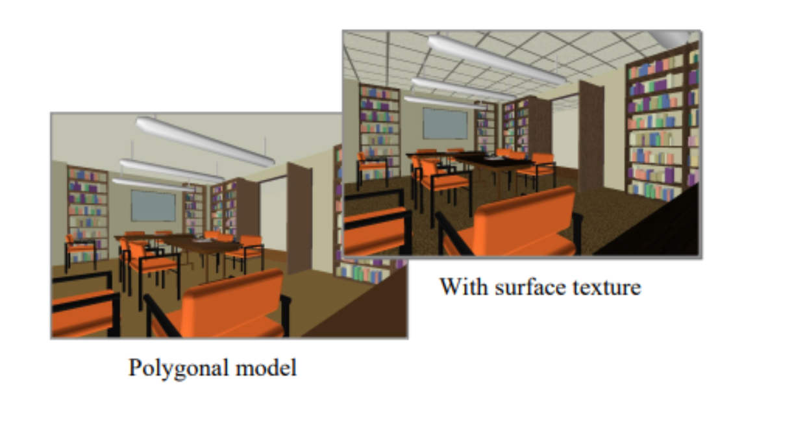

# Lecture 7 (14/08)

## Shading vs illumination model
- there is a difference between the shading model and the illumination model used in rendering scenes
- the illumination model is about determining how light sources interact with object surfaces (intensity of the light that is reflected at a given point on a surface)
- the shading model determines how to render the faces of polygons in the scene, given the illumination

### Light source models
- point source (a): all light rays originate at a point and radially diverge
- parallel source (b): light rays are all parallel; may be modelled as a point source at infinite distance (e.g. the sun)
- distributed source (c): all light rays originate at a finite area in space; it models a nearby source, such as a fluorescent light

## Shading techniques
there are 2 types of shading:
- flat shading: no interpolation
- smooth shading: linear change (interpolation)

### Flat shading
- in flat shading, the same values are used to render the entire polygon
- misses out on shading variations

why even use flat shading:
- much faster and simpler to compute when compared to smooth shading
- realistic in certain cases, like:
    - polygon is small enough
    - eye is very far away (Mach Band Effect is not as noticeable)

#### Mach Band effect
- exaggerates the contrast between edges of the slightly differing shades of a colour, as soon as they contact one another
- triggered by edge-detection enabled by the human eye, it accentuates the discontinuity at the boundary

### Smooth shading
- with smooth shading the lighting is computed at multiple points on each polygon
- as a result, no Mach Band effect
- most popular methods of implementing smooth shading are:
    - Gouraud shading
    - Phong shading

#### Gouraud shading
- lighting calculated for each polygon vertex
- colours are interpolated for the interior pixels
- linear change from one vertex colour to another

drawbacks:
- assumes linear change across the polygon
- if a polygon surface has a high curvature, then the shading can be inaccurate

Gouraud shading algorithm follows 3 main steps:
- determine the normal at each polygon vertex (average of the normal of adjacent faces)
- apply an illumination model to each vertex to calculate the vertex intensity
- linearly interpolate the vertex intensities over the surface polygon

#### Phong shading
- similar to Gouraud, except interpolate the surface normals, and do full shading calculation at every pixel using these interpolated normal
- typically much slower than Gouraud shading, but does a much better job of handling highlights than Gouraud shading

Phong shading algorithm follows 3 main steps:
- determine the normal at each polygon vertex (average of the normal of adjacent faces)
- linearly interpolate the vertex normals over the surface polygon
- apply the illumination model along each scan line to calculate
intensity of each surface point

#### Gouraud vs Phong shading

Gouraud (left) vs Phong (right) with a highlight falling at left vertex

Gouraud shading for instance will miss highlights in the middle of polygons as it only applies the lighting model at the vertices. This can be overcome to some extent by using more polygons.

### Cel shading

cel shading (also toon shading) is a non-realistic shading technique aimed at making objects look like comic books

## Textures

after creating an object within a 3D scene, it is possible to apply a texture

### Texture mapping

texture mapping maps a planar image (typically 2D) onto a 3D object, adding visual detail

Caveat | Details | Example
------ | ------- | -------
texture map may be smaller than the surface | <ul><li>if you replicate the texture, the image may not look natural</li><li>if you do not replicate the texture, then the texture will not cover the whole surface</li><li>texture synthesis can address this problem, but only works in random looking textures</li><li>generate synthetic textures of arbitrary size based on the characteristics of a sample input image</li><li></li><li></li></ul> | 
when applying the same texture across multiple objects, it may be necessary to correctly align them | - | 

### Displacement mapping

- displaces each point on the surface
- texture values gives amount to move in direction normal to surface

### Bump mapping

- used to generate rough surfaces, without increasing the number of polygons
- the surface does not change, but shading makes it look like it did
- convincing at a distance, not so much when up close
- can be used to add realism to textures (e.g. orange peel)

