# Lecture 8 (15/08)

## Collision detection
- is all about the detection of an intersection between different objects in a virtual environment
- prevent objects from just going through each other as if they are not even there
- produce realistic virtual environments by having objects react/behave accordingly when a collision happens

Collision in 2D apps | Collision in 3D apps
-------------------- | --------------------
just need to check if the coordinates of each of the boxes intersect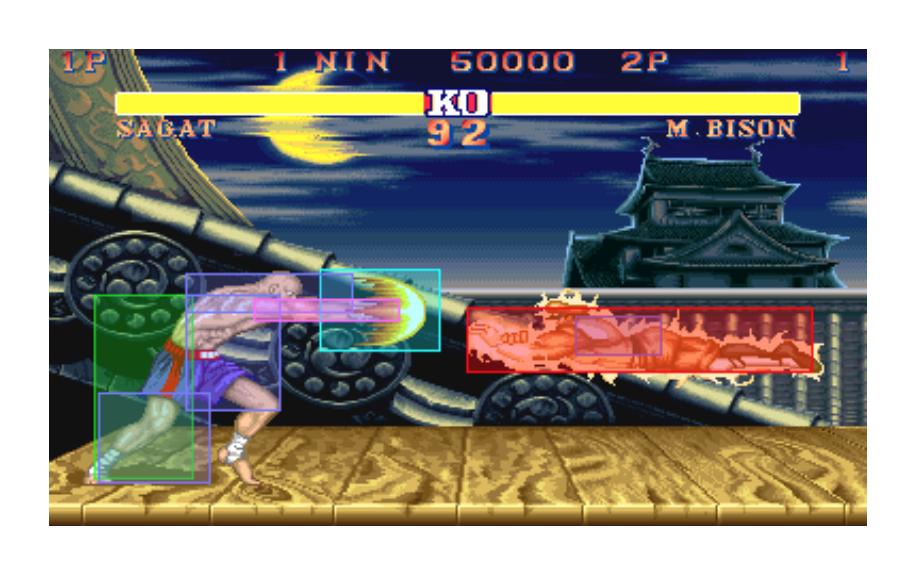 | <ul><li>extra coordinate and polygons make the process of detecting collision far more complex (check every single polygon for intersection)</li><li>cases of false positives and false negatives</li></ul>

2 main approaches for collision detection:
- continuous (a priori)
- discrete (a posteriori)

## Continuous collision detection
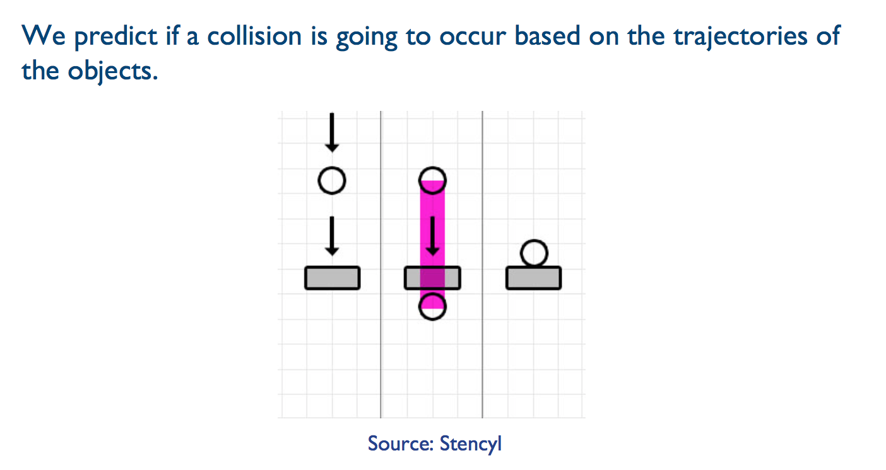

while robust, it has drawbacks:
- if you have 1 object with 100 triangles, and another with 200, there are 100*200 = 20,000 different potential intersections to calculate
- particularly true when you have a dynamic virtual environment with a high number of objects constantly moving
- computationally complex, can affect performance (framerate drops)

## Discrete collision detection
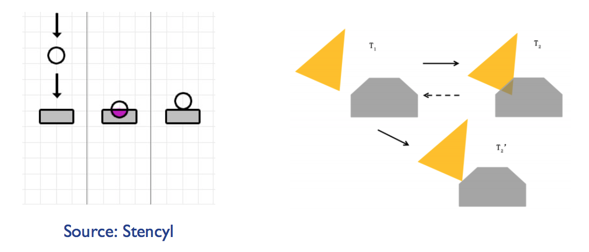
- allows objects to actually penetrate each other
- physics engine pushes it back to where the collision happened initially (do not see the middle part of the diagram above)
- much more efficient than the continuous approach, but tunnelling can occur when a very fast object passes through another object, and the engine does not detect the collision

## Bounding volumes
- can be used to further simplify collision detection
- these volumes enclose the whole object, and should be as small as possible
- most common ones are bounding boxes and spheres, but other shapes also used, e.g. ellipsoids/capsules
- one drawback is that collision detection becomes less accurate in terms of precise object volumes

### Axis Aligned Bounding Box (AABB)
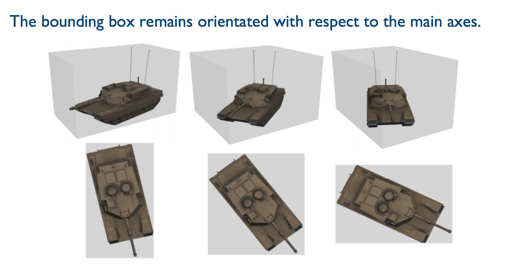

Pros | Cons
---- | ----
translation invariant (does not change if you move every point of the object by the same amount in a given direction) | with other movements, box no longer remains axis-aligned
very simple to compute | needs to be recomputed on every frame

### Oriented Bounding Box (OBB)
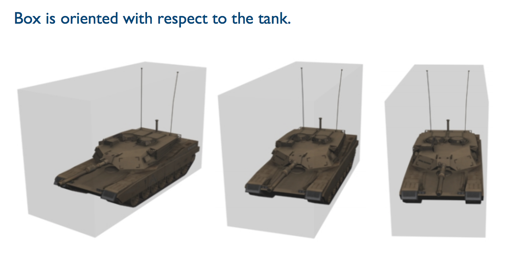

Pros | Cons
---- | ----
transformation (translation, reflection, rotation) invariant | computation of intersections is much more complex as box orientation is dynamic
volume is more compact than AABB, so less empty space | -

### Bounding spheres
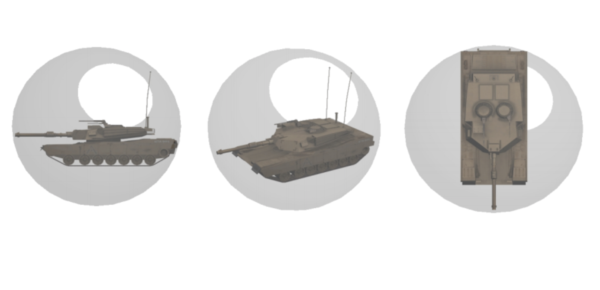

Pros | Cons
---- | ----
transformation invariant | more empty space in the volume
simple collision detection    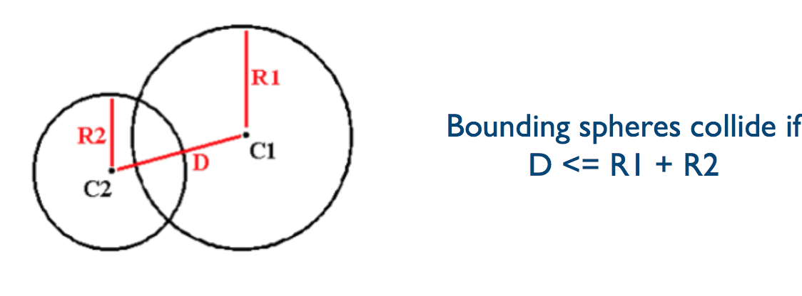 | -

## Hierarchical bounding volumes
two-phase approach to improve efficiency:
- broad phase (simple, low cost): first pass on the bounding volumes to identify potential collisions, while marking volumes (objects) that are definitely not colliding
- narrow phase (complex, high cost): based on the identified potential collisions from the broad phase, conduct exact collision tests to determine whether the object will collide

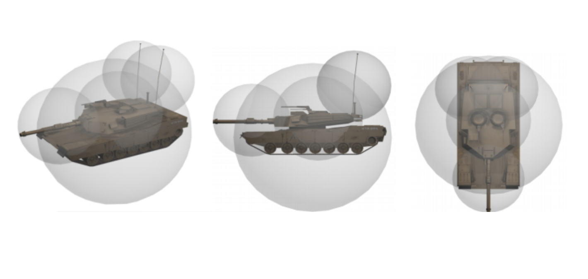

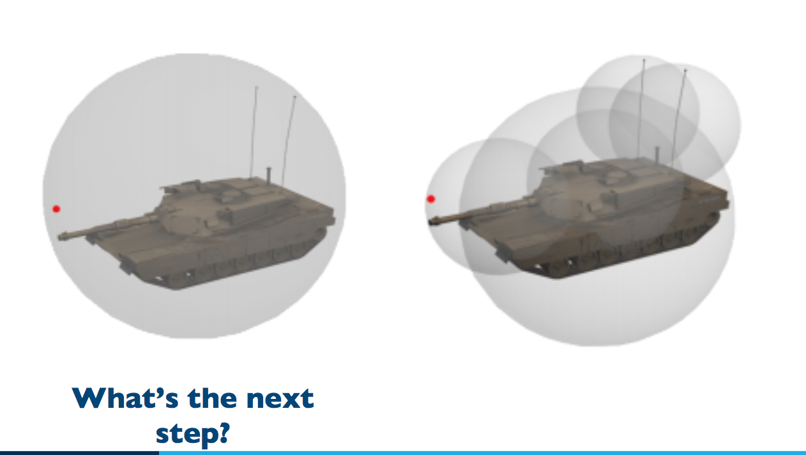
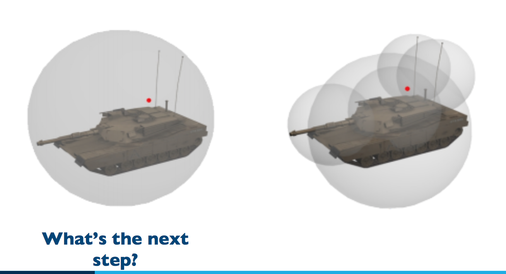

## Hitboxes
- typically used in video games for real-time collision detection
- are simplified bounding volumes as they are used to detect one-way collisions, e.g. bullets hitting a character's head

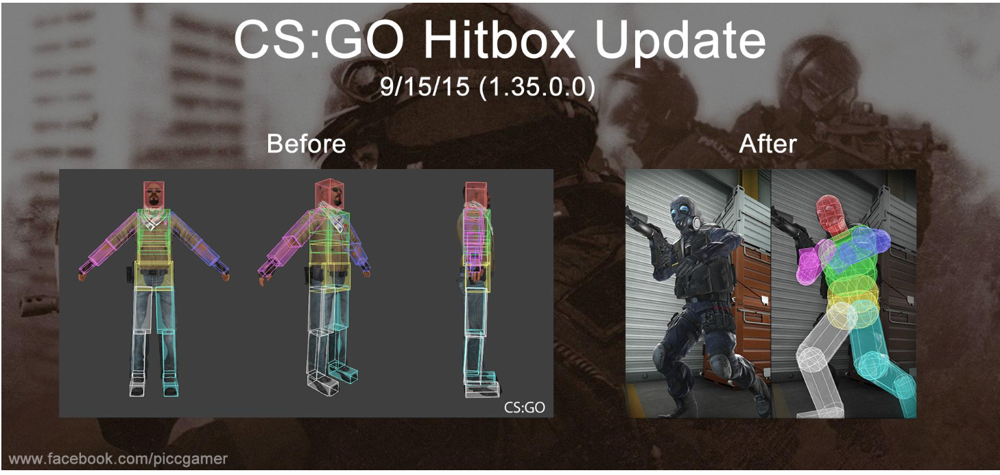