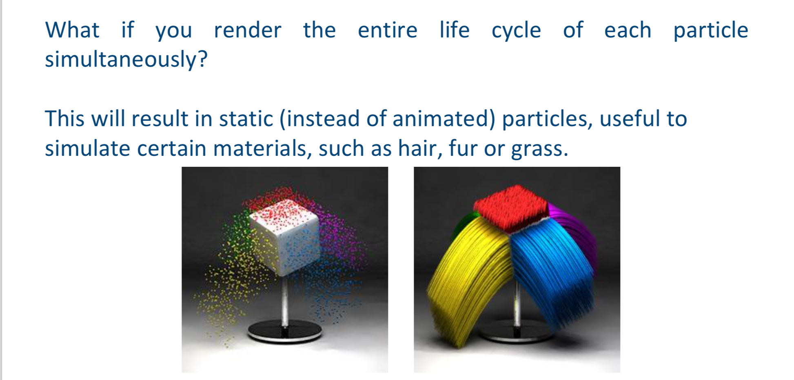
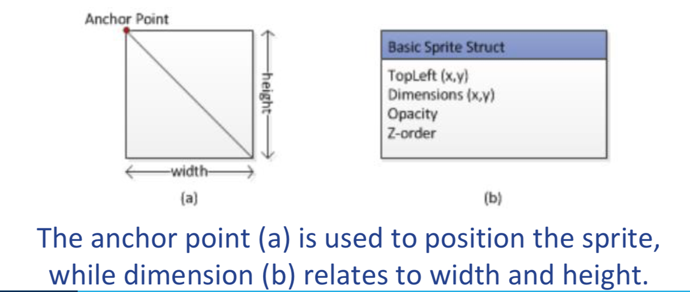
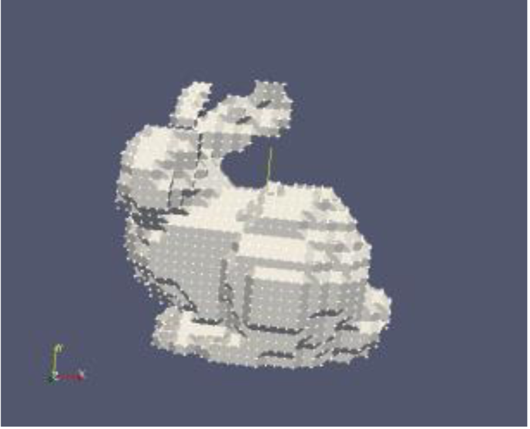

# Lecture 9 (21/08)

## Particle systems
- definition: a particle system is a collection of many small particles that together represent a fuzzy object. Over a period of time, particles are generated into a system, move and change from within the system, and die from the system
- particle systems handling happened in the geometry shader stage of the pipeline
- because straight after the geometry shader is the stage where output is fed back into the memory
- geometry shader:
    - primary use is to create new primitives from existing ones
    - most useful in creating particle systems
- relying less on the CPU and more on the GPU to handle dynamic particle systems
- have been used extensively in CG in cinema, animations, digital art and video games
- are used to model various irregular types of natural phenomena, such as: fire, smoke, waterfalls, fog, bubbles, explosions, etc.

All particle systems follow 2 main criteria:
- collection of particles:
    - a particle system is composed of 1 or more individual particles
    - each of these particles has attributes that (in)directly affect the behaviour of the particle or ultimately how and where the particle is rendered
- stochastically-defined attributes:
    - has random characteristics;
    - introduction of some type of random element that affects particle interaction and movement via stochastic limits (bounds, variance, distribution)
    - this random element can be used to control the particle attributes

The particles can have a number of different attributes:
- emission (speed, spread, rate)
- age (time that a particle has been alive)
- lifespan (infinite, constant, variable)
- opacity (static, dynamic)
- colour (static, dynamic)
- size
- shape

## Life cycle
each particle in a particle system goes through 3 different phases:
- generation
- dynamics (how the particles move and change)
- extinction

### Generation
- particles in the system are generated randomly within a pre-determined location of the fuzzy object
- this space is termed the generation shape of the fuzzy object, and this generation shape may change over time
- each of the attributes is given an initial value; these may be fixed or may be determined by a stochastic process

### Dynamics
- attributes of each of the particles may vary over time
- in general, each of the particle attributes can be specified by an equation with time as the parameter
- particle attributes can also be functions of other particle attributes, e.g. particle position is dependent on previous particle position and velocity and time

### Extinction
some criteria for terminating a particle prematurely (happens on a per particle basis):
- runnings out of bounds — if a particle moves out of the viewing area and will not re-enter it, then there is no reason to keep the particle active
- hitting the ground — assumed that particles that run into the ground burn out and can no longer be seen
- some attribute reaches a threshold — e.g. if the particle colour is so close to black that it will not contribute any colour to the final image, then destroy it

## Rendering

particle simulations can be achieved via:
- sprite (2D) particle systems
- voxel (3D) particle systems

### Sprites

- a sprite is a textured quad
- sprite dimensions and position are usually controlled by 2 sets of values:
    - anchor point position
    - sprite dimensions

### Voxels

- are essentially 3D pixels
- can be very computationally challenging — that is why they're mostly only used in cinemas and rarely in other means of visualisations